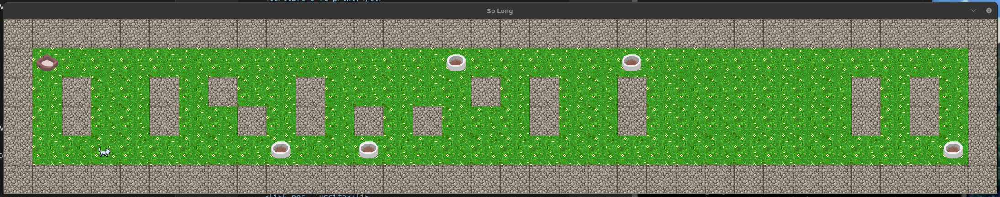
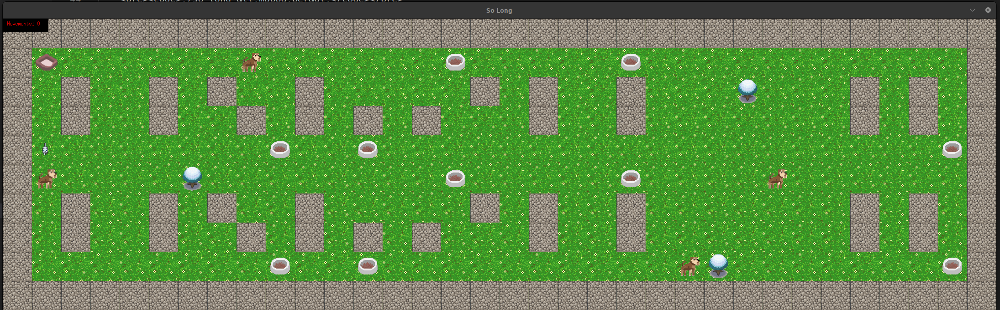

# So Long



## Descrizione

**So Long** è un piccolo gioco 2D sviluppato in C utilizzando la libreria grafica **MiniLibX**. L'obiettivo del gioco è raccogliere tutti gli oggetti collezionabili presenti nella mappa e raggiungere l'uscita.

## Caratteristiche principali

- Implementazione di una finestra di gioco con gestione di eventi.
- Controllo del personaggio tramite tastiera.
- Convalida della mappa per garantire la giocabilità.
- Grafica realizzata con texture e sprite.
- Sistema di conteggio mosse.
- Supporto a diversi layout di mappa.

## Requisiti

- MiniLibX
- GCC con i flag `-Wall -Wextra -Werror`
- libft e ft_printf

## Installazione

```bash
git clone https://github.com/tuo-repo/so_long.git
```
cd so_long
make

## Utilizzo

```bash
./so_long <mappa.ber>
```
Dove <mappa.ber> è un file di mappa valido contenente:

- 1 per i muri
- 0 per le aree attraversabili
- C per gli oggetti collezionabili
- E per l'uscita
- P per la posizione iniziale del giocatore

## Controlli
- W / Freccia su - Muovi il personaggio in alto  
- S / Freccia giù - Muovi il personaggio in basso  
- A / Freccia sinistra - Muovi il personaggio a sinistra  
- D / Freccia destra - Muovi il personaggio a destra  
- ESC - Esci dal gioco
  
## Struttura del progetto  
so_long.c - Entry point del programma  
mlx_init.c - Inizializzazione della finestra  
ft_hook.c - Gestione degli input  
ft_to_allocate_map.c - Allocazione della mappa  
ft_to_validate_map.c - Validazione della mappa  
ft_to_exit.c - Funzioni di uscita  
  
### Bonus

Nemici che fanno perdere il giocatore.  
Animazioni per il personaggio.  
Contatore delle mosse visibile.  

## Votazione


# Licenza
Progetto realizzato per scopi educativi nell'ambito del curriculum 42. Sviluppato con ❤️ 

Autore
fmontini - fmontini@student.42.fr
