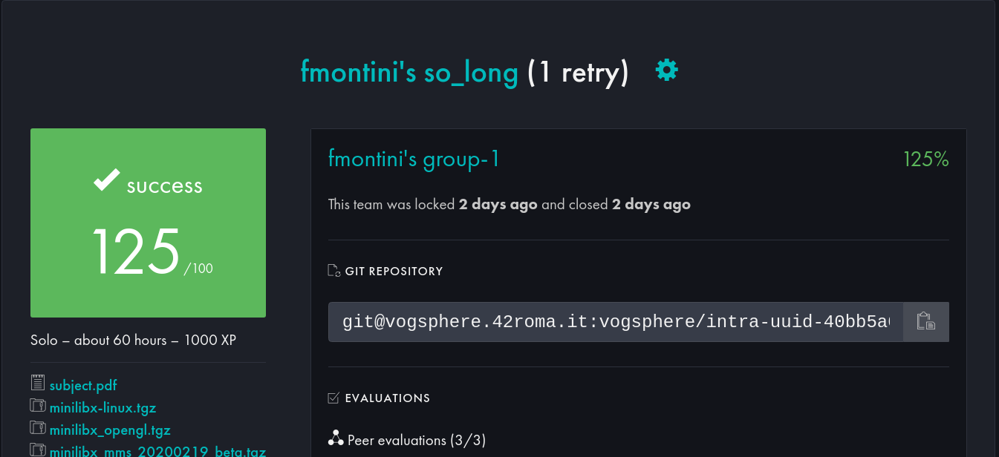

<!DOCTYPE html>
<html lang="it">
<head>
    <meta charset="UTF-8">
    <meta name="viewport" content="width=device-width, initial-scale=1.0">
    <title>So Long - Readme</title>
    
</head>
<body>
    <h1>So Long</h1>
    <h2>Votazione</h2>
    
    
    <h2>Descrizione</h2>
    
<strong>So Long</strong> è un piccolo gioco 2D sviluppato in C utilizzando la libreria grafica <strong>MiniLibX</strong>. L'obiettivo del gioco è raccogliere tutti gli oggetti collezionabili presenti nella mappa e raggiungere l'uscita.

    
    <h2>Caratteristiche principali</h2>
    <ul>
        <li>Implementazione di una finestra di gioco con gestione di eventi.</li>
        <li>Controllo del personaggio tramite tastiera.</li>
        <li>Convalida della mappa per garantire la giocabilità.</li>
        <li>Grafica realizzata con texture e sprite.</li>
        <li>Sistema di conteggio mosse.</li>
        <li>Supporto a diversi layout di mappa.</li>
    </ul>
    
    <h2>Requisiti</h2>
    <ul>
        <li>MiniLibX</li>
        <li>GCC con i flag <code>-Wall -Wextra -Werror</code></li>
        <li>libft e ft_printf</li>
    </ul>
    
    <h2>Installazione</h2>
    <pre><code>git clone https://github.com/tuo-repo/so_long.git
cd so_long
make</code></pre>
    
    <h2>Utilizzo</h2>
    <pre><code>./so_long &lt;mappa.ber&gt;</code></pre>
    
Dove <code>&lt;mappa.ber&gt;</code> è un file di mappa valido contenente:

    <ul>
        <li>1 per i muri</li>
        <li>0 per le aree attraversabili</li>
        <li>C per gli oggetti collezionabili</li>
        <li>E per l'uscita</li>
        <li>P per la posizione iniziale del giocatore</li>
    </ul>
    
    <h2>Controlli</h2>
    <ul>
        <li><strong>W / Freccia su</strong> - Muovi il personaggio in alto</li>
        <li><strong>S / Freccia giù</strong> - Muovi il personaggio in basso</li>
        <li><strong>A / Freccia sinistra</strong> - Muovi il personaggio a sinistra</li>
        <li><strong>D / Freccia destra</strong> - Muovi il personaggio a destra</li>
        <li><strong>ESC</strong> - Esci dal gioco</li>
    </ul>
    
    <h2>Struttura del progetto</h2>
    <ul>
        <li><code>so_long.c</code> - Entry point del programma</li>
        <li><code>mlx_init.c</code> - Inizializzazione della finestra</li>
        <li><code>ft_hook.c</code> - Gestione degli input</li>
        <li><code>ft_to_allocate_map.c</code> - Allocazione della mappa</li>
        <li><code>ft_to_validate_map.c</code> - Validazione della mappa</li>
        <li><code>ft_to_exit.c</code> - Funzioni di uscita</li>
    </ul>
    
    <h2>Bonus</h2>
    
    <ul>
        <li>Nemici che fanno perdere il giocatore.</li>
        <li>Animazioni per il personaggio.</li>
        <li>Contatore delle mosse visibile.</li>
    </ul>
    
    <h2>Licenza</h2>
    
Questo progetto è distribuito sotto licenza MIT. Sentiti libero di modificarlo e migliorarlo!

    
    <h2>Autore</h2>
    
<strong>fmontini</strong> - <a href="mailto:fmontini@student.42.fr">fmontini@student.42.fr</a>

</body>
</html>
